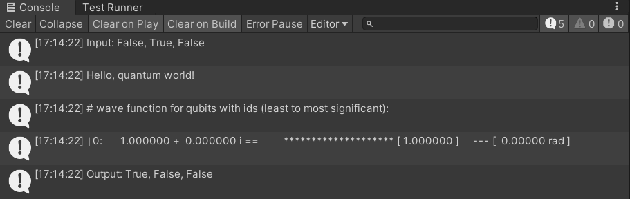

# Q# <-> Unity

## Background

Someone mentioned at a QC meetup that it would be cool to see Q# and Unity work together. So, I figured it was worth a quick-and-dirty prototype. I did this work back in October 2020 and never released it because it doesn't have a sustainable workflow (more on that later). After someone tagged me in a tweet I figured it would be worth re-visiting:

<blockquote class="twitter-tweet"><p lang="en" dir="ltr">Hello <a href="https://twitter.com/amir_e?ref_src=twsrc%5Etfw">@amir_e</a>!<br>Would you happend to have any insight about &quot;How could you use Q# within Unity?&quot; <br>➡️ <a href="https://t.co/mmE3yB7Ix3">https://t.co/mmE3yB7Ix3</a></p>&mdash; LittleCoinCoin (@LittleCoinCoin1) <a href="https://twitter.com/LittleCoinCoin1/status/1369245892168085517?ref_src=twsrc%5Etfw">March 9, 2021</a></blockquote> <script async src="https://platform.twitter.com/widgets.js" charset="utf-8"></script>

Even then, I'm just getting to it now, unfortunately. So, included in this repo is a Unity project that will allow you to write some code like this:

```csharp
public class Test : MonoBehaviour
{
    // Start is called before the first frame update
    async void Start()
    {
        UnitySystemConsoleRedirector.Redirect();

        var bits = new[] { false, true, false };
        using (var sim = new QuantumSimulator())
        {
            Console.WriteLine($"Input: {bits.ToDelimitedString()}");

            var restored = await RunAlgorithm.Run(sim, new QArray<bool>(bits));
            Console.WriteLine($"Output: {restored.ToDelimitedString()}");

            Debug.Assert(bits.Parity() == restored.Parity());
        }
    }
}
```

and see output like this in the Console window:


It makes use of a [Q# program](quantum/Library.qs#L72) (i.e. RunAlgorithm) that must be compiled separately (if you want to modify) and copied to the `Packages/host/` directory. However, this step isn't necessary if you just want to run the above and test. I have already checked in a built copy of the assembly into the repository.

## Workflow
Requires: 
* Unity 2019.4 LTS version installed (I used 2019.4.23f1)
* Visual Studio 2019 (may work with VSCode, but I didn't test)
* [Quantum Development Kit (QDK)](https://docs.microsoft.com/en-us/azure/quantum/install-overview-qdk)
* Custom [qsharp-runtime](https://github.com/amirebrahimi/qsharp-runtime) fork side-by-side this working copy
* Custom [qsharp-compiler](https://github.com/amirebrahimi/qsharp-compiler) fork side-by-side this working copy

For the above, I think the easiest thing to do is open up the `quantum-dotnet.sln` project and see what Visual Studio complains about (e.g. it may not even load the projects because you're missing something). Install those things and then you'll probably find more things that are complained about (e.g. missing QDK components). I ended up doing the following from a VS developer command prompt after seeing some warnings in Visual Studio:

> `dotnet restore quantum-dotnet.sln`

I think this downloads missing dependencies, but I'm not entirely sure. Unfortunately, I still got an error with trying to build after copying this across machines and a fresh install of Windows:

```
Error	QS7016	Unable to load the file "C:\...\qsharp-runtime\src\Simulation\CsharpGeneration\bin\Debug\netstandard2.0\Microsoft.Quantum.CsharpGeneration.dll" specifying transformations to perform as part of the compilation process. Unable to load one or more of the requested types.
```

Perhaps you won't get this error, but I don't have any interest in investigating further. The workflow is not sustainable because it required the following:

1. A custom fork of `qsharp-compiler` and `qsharp-runtime` in order to compile under netstandard2.0. Unity unfortunately [didn't support netstandard2.1 yet](https://github.com/dotnet/standard/issues/1330) (at the time I did this work) and it [wasn't clear yet on when it would be supported](https://forum.unity.com/threads/net-standard-2-1.757007/). This was not an easy feat to get it to compile and I have no interest in maintaining a fork of those two projects.
2. So much of the pipeline between `qsharp-compiler` and `qsharp-runtime` relies on them working in tandem, so I had to manually compile .qs files in order to complete the build process for those custom forks.
3. Generated files require a manual copy into Unity along with their dependencies.

This brings me to my final point -- **I'm not going to support any of this because it is just too much work for a single person**. You'll notice that I've removed the Issues feature from GitHub and will archive the repository (as read-only) after committing everything. My guess is that something will break along the way for you to try and re-trace my steps. I simply figured I'd provide this to those of you who are interested about integration and looking for a jumping-off point.

The good news is that as I write this up and look back at the netstandard2.1 issue I mentioned above I see that Unity is [just now releasing experimental support in 2021.2.0a8](https://forum.unity.com/threads/unity-future-net-development-status.1092205/). Perhaps give that a shot and see if you have better luck with getting Q# programs into Unity. Maybe some of what I have shared here can help.